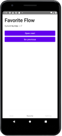
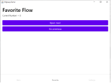

[](https://repo.maven.apache.org/maven2/io/github/alexgladkov/)
[](https://github.com/AlexGladkov/Odyssey/tree/main/common/common-compose)
[](https://www.jetbrains.com/ru-ru/lp/compose-mpp/)

**Odyssey**

Odyssey it's a declarative multiplatform navigation library for Multiplatform Compose

```kotlin
fun RootComposeBuilder.splashScreen() {
    screen("splash") { SplashScreen() }
}

class MainActivity : AppCompatActivity() {

    override fun onCreate(savedInstanceState: Bundle?) {
        super.onCreate(savedInstanceState)

        setupNavigation("splash") {
            splashScreen()
        }
    }
}
```

### Documentation
[Getting Started](documentation/GETTING_STARTED.md)

### Supported Features
 - Platforms: [Android](documentation/ANDROID.md), [Desktop](documentation/DESKTOP.md)
 - [Simple navigation](documentation/SINGLE_SCREEN.md)
 - [Nested navigation](documentation/FLOW_SCREEN.md)
 - [Params support](documentation/PARAMS_SUPPORT.md)
 - [Bottom Navigation View](documentation/BOTTOM_NAVIGATION.md)
 - [Multiple Modal Sheets](documentation/BOTTOM_SHEET.md)
 - [Tab Navigation](documentation/TAB_NAVIGATION.md)
 - [Side Drawer](documentation/SIDE_DRAWER.md)
 - [State Saving](documentation/STATE_SAVING.md)
 - [Beautiful Transition Animations](documentation/ANIMATIONS.md)
 - [Back Press Handling](documentation/BACK_PRESS.md)
 - Deep Links
 - Easy Multi Module Integration

### Example

Inside this project you can find example and of course if you have an issue or a question 
feel free to open new issue in Issues section

[](screenshots/android-screen-favorite.png)
[](screenshots/desktop-screen-favorite.png)

### License
```
MIT License

Copyright (c) 2021 Alex

Permission is hereby granted, free of charge, to any person obtaining a copy
of this software and associated documentation files (the "Software"), to deal
in the Software without restriction, including without limitation the rights
to use, copy, modify, merge, publish, distribute, sublicense, and/or sell
copies of the Software, and to permit persons to whom the Software is
furnished to do so, subject to the following conditions:

The above copyright notice and this permission notice shall be included in all
copies or substantial portions of the Software.

THE SOFTWARE IS PROVIDED "AS IS", WITHOUT WARRANTY OF ANY KIND, EXPRESS OR
IMPLIED, INCLUDING BUT NOT LIMITED TO THE WARRANTIES OF MERCHANTABILITY,
FITNESS FOR A PARTICULAR PURPOSE AND NONINFRINGEMENT. IN NO EVENT SHALL THE
AUTHORS OR COPYRIGHT HOLDERS BE LIABLE FOR ANY CLAIM, DAMAGES OR OTHER
LIABILITY, WHETHER IN AN ACTION OF CONTRACT, TORT OR OTHERWISE, ARISING FROM,
OUT OF OR IN CONNECTION WITH THE SOFTWARE OR THE USE OR OTHER DEALINGS IN THE
SOFTWARE.
```
